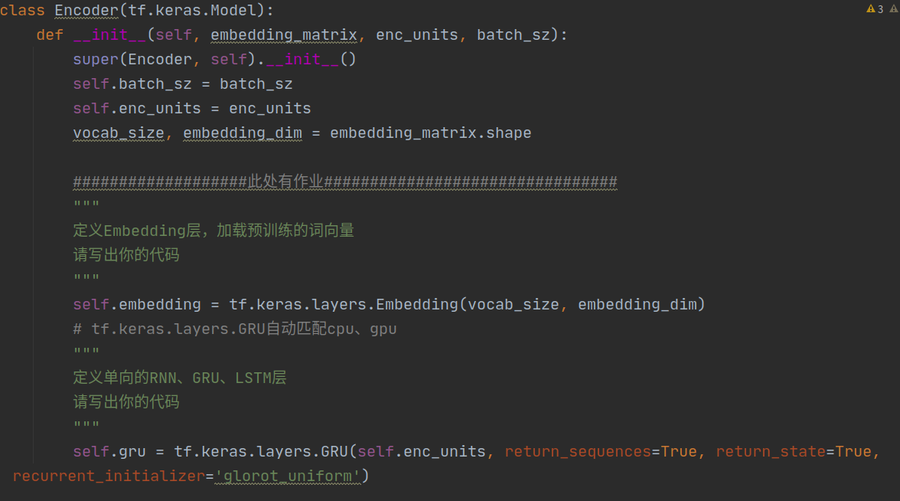
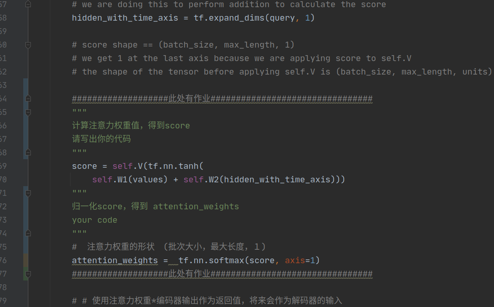
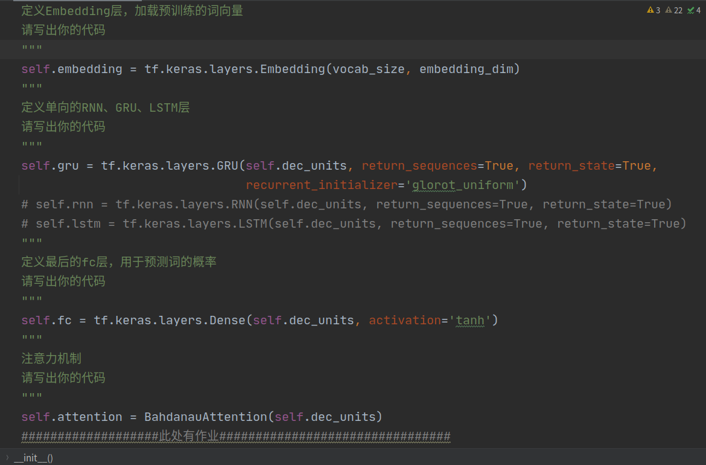
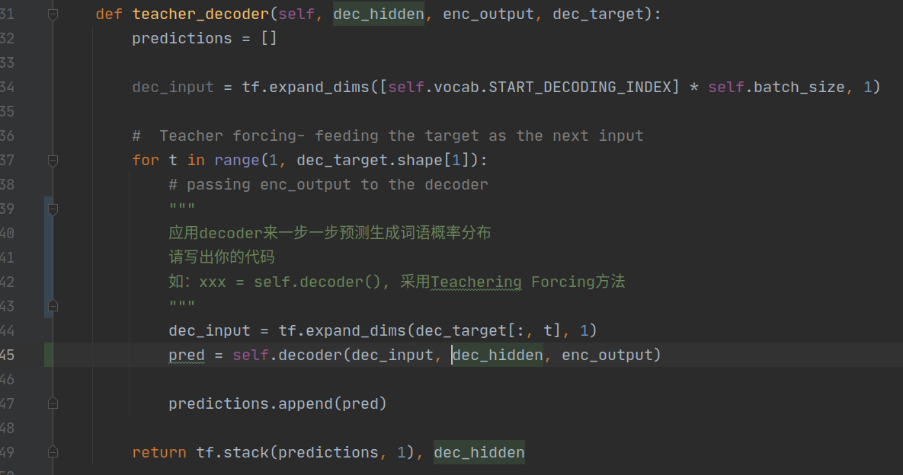
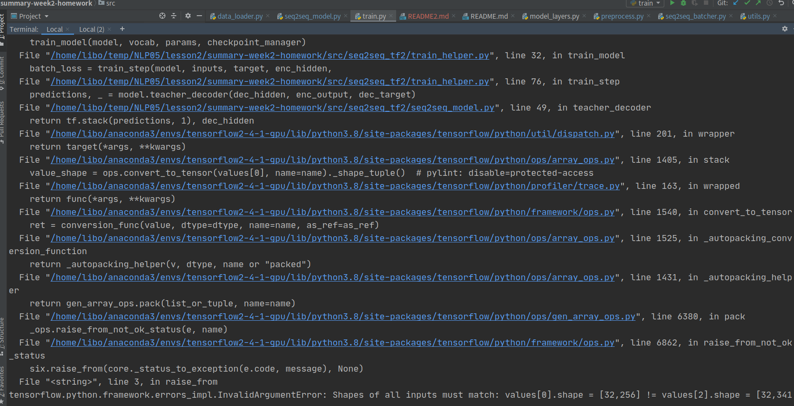
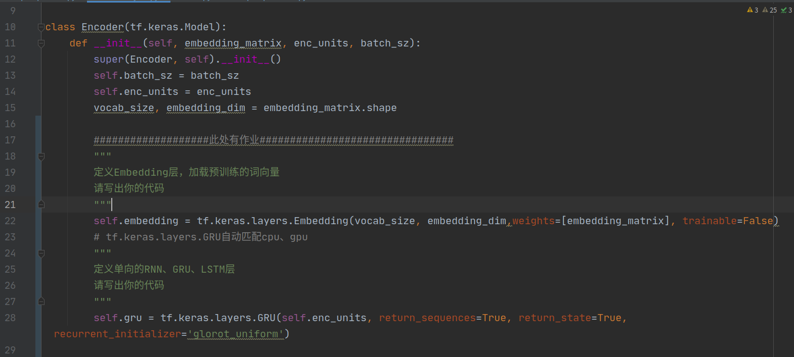
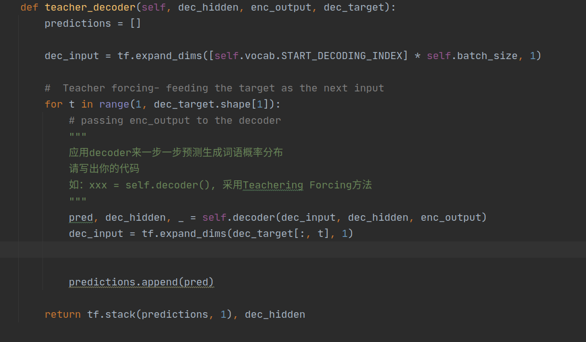

先将AutoMaster_TrainSet 和 AutoMaster_TestSet 拷贝到data 路径下 再使用 .

代码结构

+ result 结果保存路径
    ....    
+ seq2seq_tf2 模型结构
    ....
+ utils 工具包
    + config  配置文件
    + data_loader 数据处理模块
    + multi_proc_utils 多进程数据处理
+ data  数据集
    + AutoMaster_TrainSet 拷贝数据集到该路径
    + AutoMaster_TestSet  拷贝数据集到该路径
    ....

代码填充部分：
代码填充主要集中在src\seq2seq_tf2文件夹中的model_layers.py和seq2seq_model.py中，然而，由于load_dataset.py不存在，填充之后的代码没有办法跑起来，填充部分参见github中提交的model_layers.py和seq2seq_model.py文件

现在简短地在README.md文件中介绍一下我填充的代码，看看我的问题到底出在哪里

1. 在seq2seq_tf2文件夹中，在model_layers.py中填充了以下代码：

　+ 在Encoder类代码的初始化列表中加入了代码如下图所示：
    
    
   + 在BahdanauAttention类的call函数中加入代码如下图所示：
    
    
    
   + 在Decoder类代码的初始化列表中加入了如下图所示的内容：
    
   
 2.同样在seq2seq_tf2文件夹中，在seq2seq_models.py中填充了以下代码：
   + 在teacher_decoder函数的循环过程中加入了预测生成词语概率分布的代码如下图所示：
   
    
训练步骤:
1. 拷贝数据集到data路径下

+ data的数据集是完整的，如下图所示

2. 运行utils\data_loader.py可以一键完成 预处理数据 构建数据集

+ 但是，在训练过程中出现找不到load_dataset.py的问题，通过在build_data文件夹中找到了load_dataset函数，需要在seq2seq_tf2中的seq2seq_batcher.py中加入from src.build_data.utils import load_dataset
但是运行之后发现矩阵维数仍然对不上，无法进行下一步的计算，如下图所示，不知道为什么得到了341这样不是２的幂次方的维数

+ 由于utils\data_loader.py不存在，尝试使用utils\wv_loader.py进行处理

修改方法：
1. 在model_layers.py中的Encoder类和Decoder类的代码部分关于embedding的参数少写了weights的参数设置
　　self.embedding = tf.keras.layers.Embedding(vocab_size, embedding_dim,weights=[embedding_matrix], trainable=False)
  主要修改内容如下图所示：
  
  
  
  
   
    
2. 同样在model_layers.py中的Decoder类中最后的全连接层中的参数应该为整个词汇表的大小vocab_size，这个地方之前设置错了
　　 self.fc = tf.keras.layers.Dense(vocab_size)
   
   

经过以上的修改，最终模型可以跑通，经过10个Epoch训练之后，最终的损失函数下降为Epoch 10 Loss 1.4808; val Loss 1.9193
如下图所示，然而每个Epoch的损失函数下降幅度并不大，并且val loss还有增加的趋势，有可能是结果产生了过拟合，数据过少。

