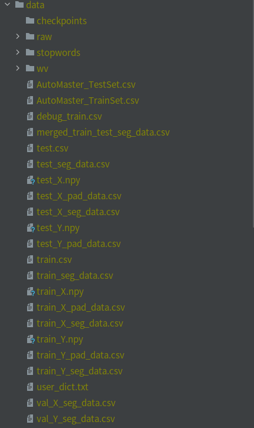
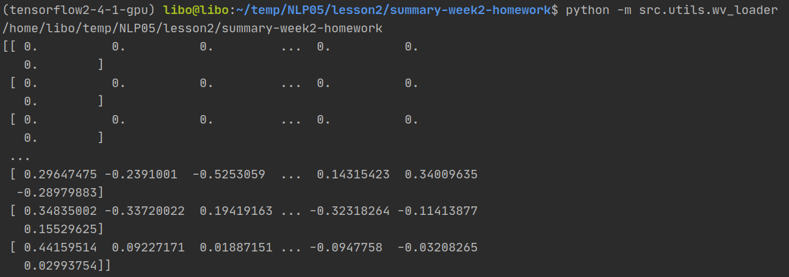

先将AutoMaster_TrainSet 和 AutoMaster_TestSet 拷贝到data 路径下 再使用 .

代码结构

+ result 结果保存路径
    ....    
+ seq2seq_tf2 模型结构
    ....
+ utils 工具包
    + config  配置文件
    + data_loader 数据处理模块
    + multi_proc_utils 多进程数据处理
+ data  数据集
    + AutoMaster_TrainSet 拷贝数据集到该路径
    + AutoMaster_TestSet  拷贝数据集到该路径
    ....

代码填充部分：
代码填充主要集中在src\seq2seq_tf2文件夹中的model_layers.py和seq2seq_model.py中，然而，由于load_dataset.py不存在，填充之后的代码没有办法跑起来，填充部分参见github中提交的model_layers.py和seq2seq_model.py文件

    
    
训练步骤:
1. 拷贝数据集到data路径下
+ data的数据集是完整的，如下图所示

2. 运行utils\data_loader.py可以一键完成 预处理数据 构建数据集

+　但是，在训练过程中出现找不到load_dataset.py的问题，通过在build_data文件夹中找到了load_dataset函数，需要在seq2seq_tf2中的seq2seq_batcher.py中加入from src.build_data.utils import load_dataset
但是运行之后发现矩阵维数仍然对不上，无法进行下一步的计算，如下图所示。

+ 由于utils\data_loader.py不存在，尝试使用utils\wv_loader.py进行处理，

